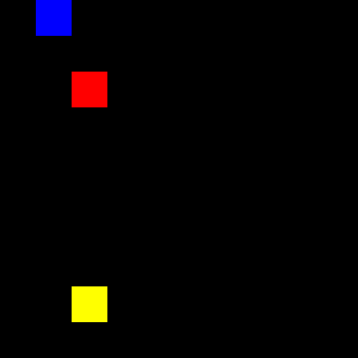
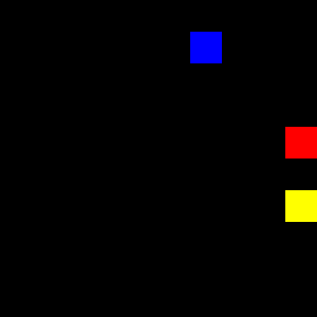

# Neural Net Sandbox

A sandbox for experimenting with neural network training for basic machine control
in simple simulation environments.

---

## Setup
### Docker Environment Setup:

Run the following from the project root to build and start the Docker container:

```bash
bash run_docker.sh
```

for development in vs code open up the devcontainer.json within vscode to properly find all the imports

### Running programs
Once docker container is launched enter into the simple example folder:

```bash
cd simple_2d_deliver_pickup/
```
run the following in terminal to see simple model:

```bash
python3 run_simple_policy.py
```
To train a simple reinforcement learning algorithm run

```bash
python3 train_nn.py
```
To utilize the trained algorithm run the following:

```bash
python3 run_trained_model.py
```
## Simple 2D Deliver Pickup
The goal of this is a machine to pickup an item at the yellow box and then deposit it at the end blue target

Example 1:



Example 2:


